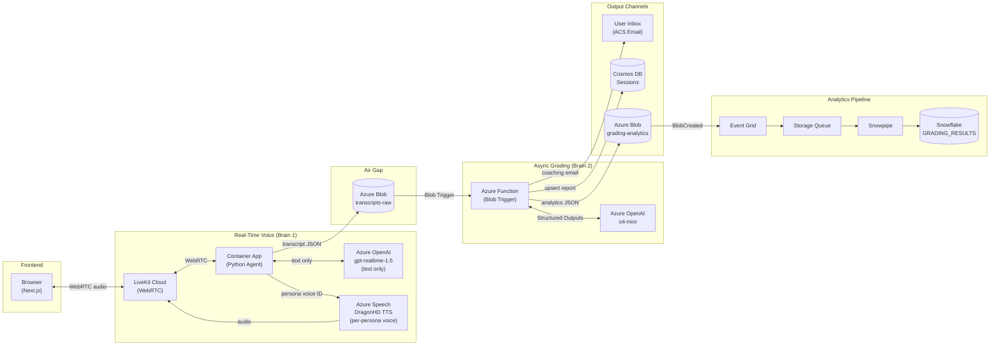

# Pitch Coach AI

> Real-time voice AI sales coaching platform with sub-second latency and automated performance grading.

---

**This repository documents the architecture and design decisions for Pitch Coach AI. Source code is available upon request for interview processes.**

📄 [Portfolio Case Study](https://jamesshehan.dev/projects/pitch-coach-ai) · 📝 [Blog Deep Dive](https://jamesshehan.dev/blog/building-real-time-voice-ai-sales-coach) · 📬 [Request Source Access](mailto:james@jamesshehan.dev?subject=Source%20Access%20Request%20-%20Pitch%20Coach%20AI)

---

## Problem

Sales representatives at franchise businesses need realistic practice against varied buyer personas, but two constraints make this exceptionally hard:

1. **Latency budget**: Conversational AI must respond in <1,000ms glass-to-glass; delays beyond 150ms degrade the user experience (ITU standard), and delays beyond 500ms cause "double-talking" that breaks immersion entirely.
2. **Grading depth vs. speed**: A rubric-based performance evaluation using `o4-mini` takes 5-15 seconds per transcript. Injecting this into a real-time conversation loop is mathematically impossible within the latency budget.

No single model can deliver both real-time voice interaction *and* deep analytical grading simultaneously.

## Architecture

The solution is a **"Two-Brain" Architecture** that decouples the conflicting requirements of speed and intelligence:

| Component | Model | Function | Latency |
|-----------|-------|----------|---------|
| **Brain 1: The Actor (text)** | `gpt-realtime-1.5` (text-only modality) | Real-time conversational reasoning | <500ms TTFT |
| **Brain 1: The Actor (voice)** | Azure DragonHD TTS (per-persona voice) | Deterministic audio synthesis | <300ms TTFB (Q8 measured p95 ~316ms) |
| **Brain 2: The Grader** | `o4-mini` | Async transcript analysis & rubric grading | 5-15s (non-blocking) |
| **Air Gap** | Azure Blob Storage | Decouples brains via event triggers | n/a |

**Why two brains?** A monolithic architecture where grading occurs in-line is impossible within the latency budget. Brain 2 runs asynchronously after the session ends, decoupled by an Azure Blob event trigger.

**Why half-cascade in Brain 1?** Voice-gender drift from `gpt-realtime`'s audio synthesis layer made personas wobble mid-conversation. The fix (ADR-020) splits Brain 1: `gpt-realtime` emits text only, and a separate Azure DragonHD TTS engine synthesizes audio with a per-persona deterministic voice ID. Voice gender cannot drift by construction. Bonus: ~98% per-session cost reduction versus full audio-to-audio billing.

## Tech Stack

| Technology | Role | Why This Choice |
|-----------|------|-----------------|
| Azure OpenAI `gpt-realtime-1.5` | Real-time conversational reasoning (Brain 1, text-only modality after ADR-020) | Low-latency token generation, tool calling, structured persona behavior |
| Azure Speech DragonHD TTS | Audio synthesis (Brain 1, half-cascade after ADR-020) | Deterministic per-persona voice ID; voice gender cannot drift; <300ms first-byte latency |
| LiveKit Cloud + Agents SDK v1.5.9 | WebRTC transport & agent framework | Managed SFU with global edge network, Python agent SDK, `livekit-plugins-azure` for half-cascade TTS routing |
| Microsoft Entra (Managed Identity) | Speech service auth | `aad#{resourceId}#{aadToken}` wrapper; no plaintext Speech key, automatic rotation |
| Azure Functions (Python) | Grading pipeline (Brain 2) | Blob-triggered serverless, scales to zero, no infrastructure management |
| Azure Blob Storage | Air Gap + analytics staging | Event-driven decoupling between brains, Snowpipe-compatible |
| Azure OpenAI `o4-mini` | Rubric grading (Brain 2) | Structured Outputs for schema-compliant scoring JSON |
| Cosmos DB (Serverless) | Session persistence | Partition by session_id, serverless scales to zero |
| Azure Communication Services | Email delivery | Managed email for coaching reports |
| Snowpipe → Snowflake | Analytics pipeline | Automated ingestion of grading analytics for trend analysis |
| Next.js 16 | Frontend | App Router, TypeScript strict, Tailwind v4 |

## Technical Challenges & Solutions

### 1. Latency Budget Engineering

**Challenge**: The ITU 150ms degradation threshold vs. 5-15s grading compute time made in-line grading impossible.

**Solution**: Two-Brain split (ADR-001). Brain 1 uses `gpt-realtime-1.5` with audio-to-audio modality (no intermediate text transcoding), achieving <1,000ms glass-to-glass. Brain 2 runs asynchronously via Azure Blob trigger, completely decoupled from the voice session.

### 2. Rubric Alignment Drift

**Challenge**: Initial calibration testing revealed 50% of official OSR criteria were missing (10 criteria implemented vs. 20 in the official rubric), and ISR empathy weighting was inflated by 100% (22 pts vs. 11 pts official).

**Solution**: Full audit and realignment (ADR-008, stakeholder-approved). Expanded OSR from 2-criterion to 4-criterion per category (20 total). Corrected ISR empathy weighting. Created fair-band test transcripts for calibration validation. 199+ pytest tests ensure ongoing alignment.

### 3. Voice Gender Drift: Half-Cascade Architecture

**Challenge**: Listeners reported the assistant's voice wobbling between gender presentations mid-conversation, even though each persona was pinned to a single voice ID (e.g., `shimmer` for Sarah). Telemetry confirmed the configured `voice_id` stayed fixed throughout each session; the drift originated *inside* `gpt-realtime`'s audio synthesis layer, downstream of every config knob the application controls. No prompt-side fix could address it because the model itself decides the final waveform.

**Solution**: Half-cascade architecture (ADR-020). Switch `gpt-realtime` to text-only modality (`modalities=["text"]`) and route synthesis through `livekit-plugins-azure` to Azure Speech's DragonHD TTS with a per-persona voice ID. By construction, voice gender cannot drift; the chosen DragonHD voice is deterministic for the session. Auth uses Microsoft Entra managed identity (`aad#{resourceId}#{aadToken}` wrapper) so no plaintext Speech key lives anywhere. Pre-merge measurement: Q8 TTS TTFB p50 ~237ms, p95 ~316ms, well under the 1000ms glass-to-glass HARD gate. Side benefit: ~98% per-session cost reduction (Azure TTS at $15/1M chars vs. `gpt-realtime` audio output at $0.20/1K tokens).

### 4. Voice Activity Detection Tuning

**Challenge**: Ghost triggers (false speech detections) in production demos (34 ghost triggers in a 7.7-minute session) caused the AI persona to interrupt users mid-sentence.

**Solution**: Iterative VAD tuning across 5 addenda to ADR-012. Implemented per-persona VAD sensitivity mapping (`interrupt_sensitivity` → `vad_threshold` + `vad_silence_duration_ms`), re-differentiated ISR vs. OSR profiles, and added ghost trigger analytics to the Snowflake pipeline for data-driven tuning.

## Key Decisions

| ADR | Decision | Rationale |
|-----|----------|-----------|
| ADR-001 | Two-Brain Architecture | Only viable strategy for <1s voice + deep grading |
| ADR-005 | Universal Envelope Multi-Rubric | Support ISR (90-pt) and OSR (100-pt) rubrics with single schema via `rubric_payload` VARIANT |
| ADR-008 | Rubric Alignment with Official Sources | 50% criteria drift discovered in calibration; full realignment with stakeholder approval |
| ADR-010 | ServerVad over SemanticVad | SemanticVad introduced latency regression; ServerVad provides deterministic ms-level turn boundary control |
| ADR-012 | Interrupt Sensitivity Mapping | Single `interrupt_sensitivity` enum replaces coordinating two VAD parameters per persona |
| ADR-020 | Half-Cascade Architecture (DragonHD TTS) | Voice gender drift fix: `gpt-realtime` emits text only, Azure DragonHD TTS owns synthesis with deterministic per-persona voice IDs; ~98% per-session cost reduction |

See [docs/tech-decisions.md](docs/tech-decisions.md) for detailed ADR excerpts.

## Results

- **20 Architecture Decision Records** documenting every significant technical choice
- **Half-cascade voice pipeline**: deterministic per-persona voice IDs via Azure DragonHD TTS, voice gender cannot drift by construction
- **TTS TTFB p95 ~316ms** measured against the 1000ms glass-to-glass HARD gate (KQL Q8 telemetry)
- **199+ pytest tests** with rubric calibration validation
- **ISR (90-pt) + OSR (100-pt) dual rubric system** with per-persona grading
- **Snowpipe → Snowflake analytics pipeline** for grading trend analysis
- **Managed-identity auth** for Azure Speech; no plaintext Speech key on disk
- **Production stack**: LiveKit Agents SDK v1.5.9, Next.js 16, Azure East US 2

## Project Status

| Phase | Status | Description |
|-------|--------|-------------|
| Phase 0-1: Setup & Infrastructure | ✅ | Azure resources, Cosmos DB, Storage, LiveKit Cloud |
| Phase 2: Identity Layer | ✅ | JIT metadata injection, multi-persona support |
| Phase 3: Brain 1 (The Actor) | ✅ | Real-time voice agent with dynamic personas |
| Phase 4: Brain 2 (The Grader) | ✅ | Rubric grading pipeline, email delivery, analytics |
| Phase 5: Frontend | ✅ | Next.js UI with LiveKit WebRTC integration |
| Phase 5.5: Agent Hardening | ✅ | Identity anchoring, VAD tuning, disconnect resilience |
| Wave 5 (C1): LiveKit Tier 1 | ✅ | F1 retirement + LiveKit Agents SDK 1.5.1 → 1.5.9 + six platform features |
| Wave 5 (C2): Half-Cascade | ✅ | Voice gender drift fix via Azure DragonHD TTS, managed-identity auth, KQL Q8/Q9 telemetry |

---

**Built by [James Shehan](https://jamesshehan.dev)** · TPM / Solutions Architect

📬 [Request source code access](mailto:james@jamesshehan.dev?subject=Source%20Access%20Request%20-%20Pitch%20Coach%20AI) for interview review
